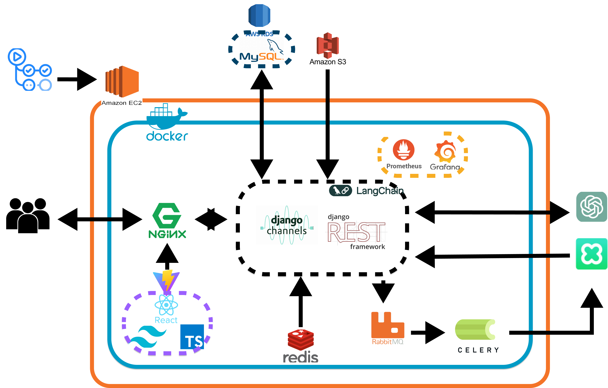

# 개발 순서

### `기획 → 협업 → 설계 → 개발 → 배포 → 고도화 → 발표`

우리 부트캠프에서는 이 순서로 개발이 이루어진다. 

각 단계에서 진행되는 프로세스에 대해서 더 알아보자.

## 기획

구현 가능성 조사와 POC는 비슷한 개념인 거  같다. 단어 사용에 주의하자

- 주제 선정
    - 프로젝트의 주제를 선정하는 단계이다, 어떤 문제를 해결할지, 어떤 기능을 제공할지를 결정한다.
    - 브레인스토밍, 시장 조사, 사용장 요구사항 분석을 통해 주제를 선정할 수 있다.
- 구현 가능성 조사
    - 선정된 주제가 기술적으로 실현 가능한지 검토하는 단계이다.
    - 기술 스택 조사, 레거시 기술 분석 등을 통해 가능성을 점춰볼 수 있다.
- POC
    - 핵심 기능의 가능성을 증명하기 위해 프로토타입을 만드는 단계이다.
    - 간단한 기능 구현, 기술 시험등을 수행한다.

## 협업

협업룰을 정하는 과정을 거쳐야 한다.

프로젝트 내 컨벤션 및 효과적인 의사소통을 위해서 여러 규칙을 정하고 관리한다.

언어나 프레임워크에 따라 특정한 스타일 가이드를 따라야하는 경우도 있ㅇ므로 개발 영역을 나누어 구체적으로 정의하는 것이 유리하다.

- 커밋 규칙
- PR 작성 규칙
- 네이밍 규칙
- 키 관리 → secrets.json

[gitmoji](https://gitmoji.dev/)

[[Git] Commit Message / PR 잘 쓰는 방법](https://velog.io/@ye-ji/Git-PR-잘-쓰는-방법)

## 설계

위에서 결정한 주제의 요구사항에 따라 적절한 기술을 선택한다.

그리고 정한 기술에 맞추어 설계도를 작성해야한다.

- 시스템 아키텍쳐

- API 설계 → Swagger 이용해서 명세
- DB 설계 → [draw.io](https://draw.io) or ERD Cloud 이용
- 디자인 설계 → 피그마 이용

[ERDCloud](https://www.erdcloud.com/)

[Flowchart Maker & Online Diagram Software](https://app.diagrams.net/)

[[TIL] Swagger를 활용한 API Docs 만들기](https://velog.io/@cabbage/TIL-Swagger를-활용한-API-Docs-만들기)

[Figma: 협업을 위한 인터페이스 디자인 도구](https://www.figma.com/ko-kr/)

## 개발

- Docker
    - 개발 환경의 일관성을 유지하고, 배포 및 실행을 단순화한다.
    - 환경 일관성, 배포 용이, 높은 확장성이 장점이다.
- Backend
    - 서버 측 로직과 데이터베이스 연동한다.
- Frontend
    - 사용자 인터페이스를 개발하고, 백엔드와의 연동을 처리한다.

[Docker: Accelerated Container Application Development](https://www.docker.com/)

[도커 한방에 정리 🐳 (모든 개발자들이 배워보고 싶어 하는 툴!) + 실습](https://www.youtube.com/watch?v=LXJhA3VWXFA)

## 배포

개발하고 사용자들이 실제로 쓸 수 있게 배포하는 과정이 필요

GCP CE, AWS EC2, Azure 등 어떤 클라우드 서비스로 배포할지, 어떤 사양으로 할지 결정을 한 후에 배포를 한다.

- 웹서버
- 클라우드 서비스

## 고도화

CI/CD, 성능 최적화, 기능 추가등 필수 개발 과정에 들어가지 않는 부가적인 부분들을 포함한다.

- 모니터링 툴
- 코드 리팩토링

[리팩터링 2판 - 예스24](https://m.yes24.com/Goods/Detail/89649360)

배포와 고도화 작업은 모르는 게 많아서 따로 정리할 예정이다. 그리고 또한 설계 다이어그램과 같은 것들도 더 정리해서 글을 올릴 예정이다.