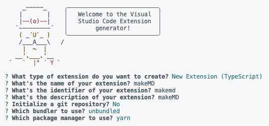

# vscode 익스텐션 배포하기
Github 블로그를 쓰다가 포스트 형식을 항상 복사해서 사용하기 불편해서 vscode 익스텐션이 있으면 좋겠다는 생각을 해
익스텐션을 만들어 배포해보았다.

<br/>

## Extension 만들기
우선 익스텐션은 yo를 사용해 만들 수 있다. 
```
npm install -g yo generator-code
```
yo 설치를 완료했으면

<br/>

```
yo code
```

<br/>

이 코드를 실행시켜 프로젝트 생성을 한다.

<br/>



<br/>
최근 프로젝트를 타입스크립트로 진행했기에 타입스크립트 기반으로 만들어 보았다.

<br/>


그럼 다음과 같은 구조의 폴더가 만들어지는데 여기서 봐야할 파일은 extension.ts와 pakege.json 파일이다.


말 그대로 extension.ts는 우리가 생성하는 익스텐션의 구현이 들어가는 파일이고 pakage.json은 우리 익스텐션의 정보들이 적혀있다.


### 코드
- extension.ts

<br/>


```ts
import * as vscode from "vscode";
import * as path from "path";
import * as fs from "fs";

export function activate(context: vscode.ExtensionContext) {
  let disposable = vscode.commands.registerCommand(
    "makemd.makemd",
    async () => {
      try {
        // 사용자로부터 타이틀 입력 받기
        const title = await vscode.window.showInputBox({
          placeHolder: "Enter the title for the post",
          prompt: "Please enter a title for the post",
          validateInput: (input: string) => {
            return input.trim() === "" ? "Title cannot be empty" : null;
          },
        });

        if (!title) {
          vscode.window.showErrorMessage("타이틀이 입력되지 않았습니다.");
          return;
        }

        // 현재 날짜와 시간 정보 가져오기
        const now = new Date();
        const year = now.getFullYear();
        const month = (now.getMonth() + 1).toString().padStart(2, "0");
        const day = now.getDate().toString().padStart(2, "0");
        const hours = now.getHours().toString().padStart(2, "0");
        const minutes = now.getMinutes().toString().padStart(2, "0");
        const seconds = now.getSeconds().toString().padStart(2, "0");
        const formattedDate = `${year}-${month}-${day}`;
        const formattedDateTime = `${formattedDate} ${hours}:${minutes}:${seconds}+0900`;

        // 파일 이름 및 내용 정의
        const fileName = `${formattedDate}-${title}.md`;
        const content = `---
title: ${title}
date: ${formattedDateTime}
categories: []
tags: []
---`;

        const workspaceFolder = vscode.workspace.workspaceFolders?.[0];

        if (!workspaceFolder) {
          vscode.window.showErrorMessage(
            "워크스페이스 폴더가 열려 있지 않습니다."
          );
          return;
        }

        // _posts 폴더 경로
        const postsFolderPath = path.join(workspaceFolder.uri.fsPath, "_posts");

        // _posts 폴더가 없으면 생성
        if (!fs.existsSync(postsFolderPath)) {
          fs.mkdirSync(postsFolderPath, { recursive: true });
        }

        const filePath = path.join(postsFolderPath, fileName);
        const uri = vscode.Uri.file(filePath);

        // 파일 생성 및 내용 쓰기
        await vscode.workspace.fs.writeFile(uri, Buffer.from(content, "utf8"));

        // 문서 열기
        const document = await vscode.workspace.openTextDocument(uri);
        await vscode.window.showTextDocument(document);

        vscode.window.showInformationMessage(
          `파일이 생성되었습니다: ${fileName}`
        );
      } catch (error: any) {
        vscode.window.showErrorMessage(`파일 생성 실패: ${error.message}`);
      }
    }
  );

  context.subscriptions.push(disposable);
}

export function deactivate() {}
```

- pakage.json

<br/>

```json
{
  "name": "makemd",
  "displayName": "makeMD",
  "description": "It makes it easy to create a post template when posting on GitHub Pages.",
  "version": "0.0.1",
  "license": "MIT",
  "publisher": "hooo",
  "engines": {
    "vscode": "^1.91.0"
  },
  "categories": [
    "Other"
  ],
  "activationEvents": [
    "onCommand:makemd.makemd"
  ],
  "main": "./dist/extension.js",
  "contributes": {
    "commands": [
      {
        "command": "makemd.makemd",
        "title": "makeMd with title"
      }
    ]
  },
  "scripts": {
    "vscode:prepublish": "yarn run package",
    "compile": "webpack",
    "watch": "webpack --watch",
    "package": "webpack --mode production --devtool hidden-source-map",
    "compile-tests": "tsc -p . --outDir out",
    "watch-tests": "tsc -p . -w --outDir out",
    "pretest": "yarn run compile-tests && yarn run compile && yarn run lint",
    "lint": "eslint src --ext ts",
    "test": "vscode-test"
  },
  "devDependencies": {
    "@types/glob": "^8.1.0",
    "@types/mocha": "^10.0.7",
    "@types/node": "20.x",
    "@types/vscode": "^1.91.0",
    "@typescript-eslint/eslint-plugin": "^7.14.1",
    "@typescript-eslint/parser": "^7.11.0",
    "@vscode/test-cli": "^0.0.9",
    "@vscode/test-electron": "^2.4.0",
    "eslint": "^8.57.0",
    "ts-loader": "^9.5.1",
    "typescript": "^5.4.5",
    "webpack": "^5.92.1",
    "webpack-cli": "^5.1.4"
  },
  "repository": {
    "type": "git",
    "url": "https://github.com/choihooo/makeMD"
  }
}
```
<br/>
나는 코딩을 할때 `command 'makemd.helloWorld' not found` 다음과 같은 오류가 발생했는데 이는
<br/>
<br/>


```ts
  let disposable = vscode.commands.registerCommand(
    "makemd.makemd",
    async () => {
```

```json
  "contributes": {
    "commands": [
      {
        "command": "makemd.makemd",
        "title": "makeMd with title"
      }
```

registerCommand의 첫번째 인자와 command가 같지 않아 발생하는 오류였다.


## 배포하기

배포하기전에 디버깅을 실행해봐야 코드가 정확한가 알아볼 수 있는데
Extension 프로젝트에서 F5를 누르면 디버깅 모드를 실행된다.그러면 새로운 vscode window가 열리게 되는데 여기서 코드를 실행해볼수 있다.

나와 같은 경우에는 익스텐션을 명령어 팔레트에서 실행하게 할거기 때문에 cmd+shift+p를 누른뒤 내가 만든 명령어 "makeMd with title" 을 검색해 실행해보았다.

그리고 문제가 없으면 배포를 시작하면 되는데 그러기 위해서는
vsce를 설치해야한다.
```
npm install -g vsce
```

설치한 후에 `vsce package` 명령어를 실행해주면 xxxx-0.0.1.vsix 파일이 만들어지게 되는데 https://marketplace.visualstudio.com/ 해당 페이지에서 익스텐션을 등록할 수 있다.

vsce를 통해 터미널로 배포할수 있지만 토큰을 발급받아야 하길래 발급하지 않아도 되는 웹에서 배포를 진행했다.

그리고 `vsce package`를 사용할때 경고가 발생했는데 
```
 WARNING  A 'repository' field is missing from the 'package.json' manifest file.
Do you want to continue? [y/N] y
 WARNING  LICENSE.md, LICENSE.txt or LICENSE not found
```

이는 익스텐션의 깃 저장소와 라이센스를 pakage.json에 명시하지 않아서 발생한 경고이다.

## 마무리
이 과정을 마치고 나면


다음 사진과 같이 익스텐션이 배포가 된다.

아주 간단한 익스텐션이지만 앞으로 블로그 포스팅에 도움이 되는 기능들을 점점 추가해 나갈 예정이다.

[익스텐션 깃허브 저장소](https://github.com/choihooo/makeMD)

추가할 점이 있으면 말해줬으면 좋겠다.