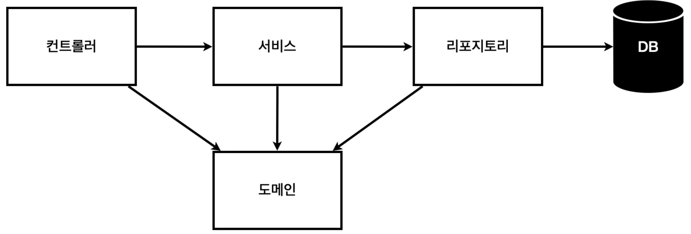
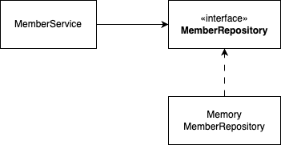

# 비즈니스 요구사항 정리

- 데이터: 회원 ID, 이름
- 기능: 회원 등록, 조회
- 아직 데이터 저장소 선정 X (가상의 시나리오)

### 일반적인 웹 애플리케이션 구조



- 컨트롤러 → 웹 MVC의 컨트롤러 역할
- 서비스 → 서비스 클래스의 핵심 비즈니스 로직(ex: 중복 가입 불가)
- 레포지토리 → 도메인 객체를 DB에 저장하고 관리
- 도메인 → 비즈니스 도메인 객체

### 회원 관리 예제의 클래스 의존 관계



- 아직 데이터 저장소가 선정되지 않아서, 레포지토리는 인터페이스로 구현
- 데이터 저장소는 RDB, NoSQL 등 다양한 저장소를 고민중인 상황
- 개발을 진행하기 위해 초기 개발 단계에서 메모리 기반의 데이터 저장소 사용

# 회원 도메인과 레포지토리 만들기

### `domain/Member.java`

```java
package hello.hello_spring.domain;

public class Member {
    private Long id;
    private String name;

    public Long getId() {
        return id;
    }

    public void setId(Long id) {
        this.id = id;
    }

    public String getName() {
        return name;
    }

    public void setName(String name) {
        this.name = name;
    }
}
```

### `repository/MemberRepository.java`

```java
package hello.hello_spring.repository;

import hello.hello_spring.domain.Member;

import java.util.List;
import java.util.Optional;

public interface MemberRepository {

    Member save(Member member);
    Optional<Member> findById(Long id);
    Optional<Member> findByName(String name);
    List<Member> findAll();
   
}
```

### `repository/MemoryMemberRepository.java`

```java
package hello.hello_spring.repository;

import hello.hello_spring.domain.Member;

import java.util.*;

public class MemoryMemberRepository implements MemberRepository{

    private static Map<Long, Member> store = new HashMap<>();
    private static long sequence = 0L;

    @Override
    public Member save(Member member) {
        member.setId(++sequence);
        store.put(member.getId(), member);
        return member;
    }

    @Override
    public Optional<Member> findById(Long id) {
        return Optional.ofNullable(store.get(id));
    }

    @Override
    public Optional<Member> findByName(String name) {
        return store.values().stream()
                .filter(member -> member.getName().equals(name))
                .findAny();
    }

    @Override
    public List<Member> findAll() {
        return new ArrayList<>(store.values());
    }
    
    public void clearStore() {
        store.clear();
    }
}
```

- `Optional`은 값의 존재 여부를 나타내며, 값이 없을 경우 발생할 수 있는 `NullPointerException`을 방지하는 데 도움을 준다.
    - 주어진 값이 존재할 수도 있고 존재하지 않을 수도 있는 상황을 명확하게 표현하기 위해 사용된다.
- **`ifPresent()`**: 값이 존재하는 경우 주어진 동작을 수행한다.
- `stream()` 메서드는 컬렉션을 일련의 요소들로 변환하여 여러 가지 중간 연산과 최종 연산을 수행할 수 있게 한다.
- `store.values().stream()`은 `store`에 저장된 모든 값을 포함하는 스트림을 생성한다.

# 회원 레포지토리 테스트 케이스 작성

```java
package hello.hello_spring.repository;

import hello.hello_spring.domain.Member;
import org.junit.jupiter.api.AfterEach;
import org.junit.jupiter.api.Test;

import java.util.List;

import static org.assertj.core.api.Assertions.*;

public class MemoryMemberRepositoryTest {

    MemoryMemberRepository repository = new MemoryMemberRepository();

    @AfterEach 
    public void afterEach() {
        repository.clearStore();
    }
    @Test
    public void save(){
        // given
        Member member = new Member();
        member.setName("spring");

        // when
        repository.save(member);

        // then
        Member result = repository.findById(member.getId()).get();
        assertThat(result).isEqualTo(member);
    }

    @Test
    public void findByName() {
        Member member1 = new Member();
        member1.setName("spring1");
        repository.save(member1);

        Member member2 = new Member();
        member2.setName("spring2");
        repository.save(member2);

        Member result = repository.findByName("spring1").get();

        assertThat(result).isEqualTo(member1);
    }

    @Test
    public void findAll() {
        Member member1 = new Member();
        member1.setName("spring1");
        repository.save(member1);
        Member member2 = new Member();
        member2.setName("spring2");
        repository.save(member2);

        List<Member> result = repository.findAll();

        assertThat(result.size()).isEqualTo(2);
    }
}

```

- shift + f6 → 중복이름 자동대치
- @AfterEach → @Test 가 끝날때 마다 실행
- @AfterEach로 clear를 호출하는 이유 → 한 번에 여러 테스트를 실행하면 메모리 DB에 직전 테스트의 값이 남을 수 있다. 이렇게 되면 이전 테스트 때문에 다음 테스트가 실패할 가능성이 있다. 그래서 clear를 이용해 메모리에 값을 지워준다.
- 테스트는 각각 독립적이여야 한다. 테스트 순서에 의존성이 있으면 좋은 테스트가 아니다.

### Given, When, Then

- `Given` → 주어진 상황, 테스트의 초기 상태
- `When` → 테스트에서 수행할 행동 (테스트 내용)
- `Then` → 예상되는 결과나 시스템의 상태

# 회원 서비스 개발

```java
package hello.hello_spring.service;

import hello.hello_spring.domain.Member;
import hello.hello_spring.repository.MemberRepository;
import hello.hello_spring.repository.MemoryMemberRepository;

import java.util.List;
import java.util.Optional;

public class MemberService {
    private  final MemberRepository memberRepository = new MemoryMemberRepository();

    // 회원가입
    public Long join(Member member){
        validateDuplicateMember(member);
        memberRepository.save(member);
        return  member.getId();
    }

    private void validateDuplicateMember(Member member){
        memberRepository.findByName(member.getName())
                .ifPresent(m -> {
                    throw new IllegalStateException("이미 존재하는 회원입니다.");
                });
    }

    // 전체 회원 조회
    public List<Member> findMembers() {
        return memberRepository.findAll();
    }

    public Optional<Member> findOne(Long memberId){
        return memberRepository.findById(memberId);
    }
}

```

# 회원 서비스 테스트

- cmd + shift + t → 테스트 자동 생성 단축키
- controll + R → 저번 실행했던 거 다시 실행

```java
package hello.hello_spring.service;

import hello.hello_spring.domain.Member;
import hello.hello_spring.repository.MemberRepository;
import hello.hello_spring.repository.MemoryMemberRepository;

import java.util.List;
import java.util.Optional;

public class MemberService {
    private  final MemberRepository memberRepository;

    public MemberService(MemberRepository memberRepository) {
        this.memberRepository = memberRepository;
    }
    // 회원가입
    public Long join(Member member){
        validateDuplicateMember(member);
        memberRepository.save(member);
        return  member.getId();
    }

    private void validateDuplicateMember(Member member){
        memberRepository.findByName(member.getName())
                .ifPresent(m -> {
                    throw new IllegalStateException("이미 존재하는 회원입니다.");
                });
    }

    // 전체 회원 조회
    public List<Member> findMembers() {
        return memberRepository.findAll();
    }

    public Optional<Member> findOne(Long memberId){
        return memberRepository.findById(memberId);
    }
}
```